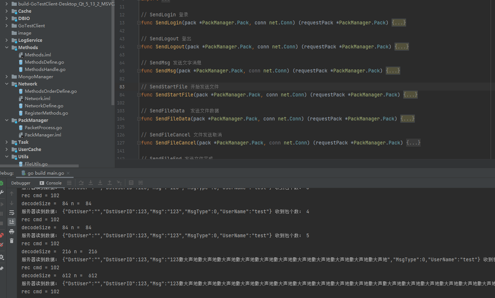
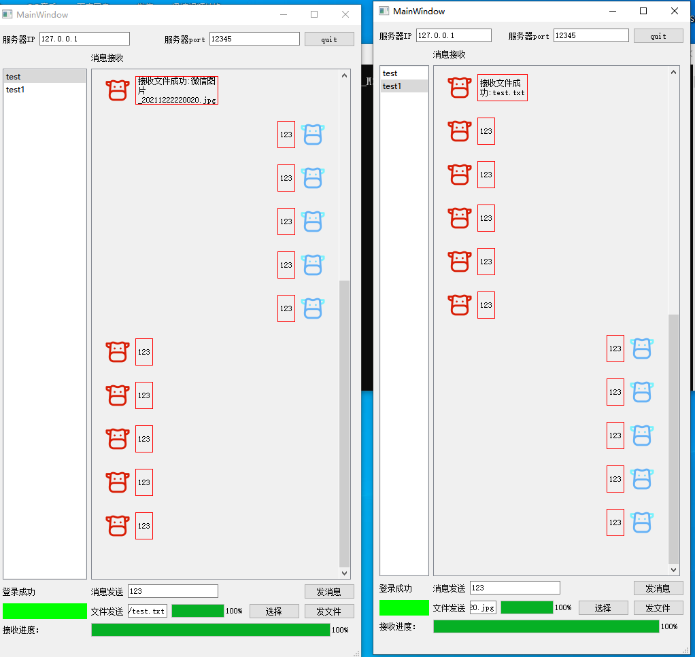
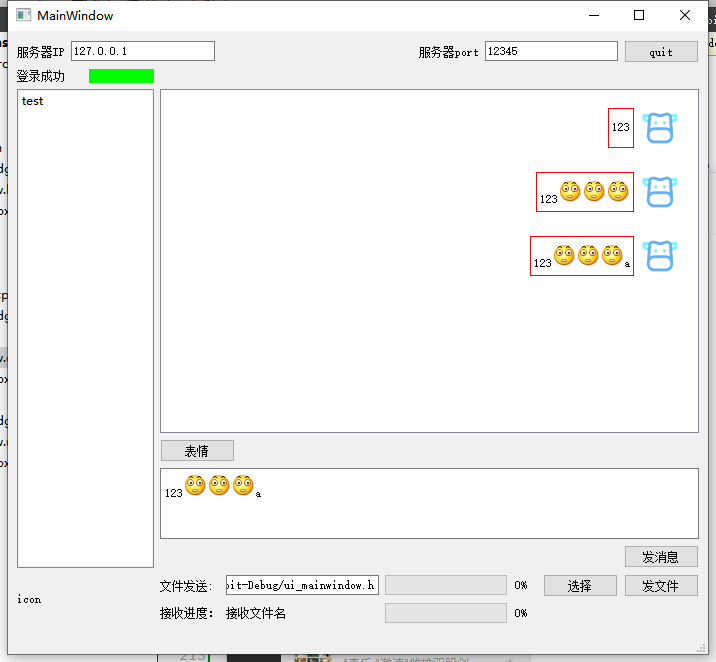

# GoTestServer

#### 介绍
golang测试并发服务器

#### 软件架构
软件架构说明

#### 开发时间

1.  2021.12.28  立项
2.  2021.12.29  做了服务器监听，完成了简单的协议处理以及tcp黏包处理，做了一些方法映射，以及客户端管理
3.  2021.12.30	添加普通消息的json转换
4.  2022.1.1    新增写文件的channel协程，封装了协程缓存，增加日志系统存储文件
5.  2022.1.2    新增mysql 连接池，redis MongoDB 暂时没写存个架构方便未来分布式，添加测试使用的QT客户端
6.  2022.1.3    客户端新增网络模块，文件批量发送，消息发送，登录功能，增加了客户端和服务端的测试登录实现目前互通已经完成
7.  2022.1.4    增加在线判断，增加人员登录后返回所有在线人员列表
8.  2022.1.5    增加客户端登录退出的功能和状态显示，服务器增加用户状态推送，服务器在客户端退出、登录、tcp连接和断开时更新用户状态信息并推送给所有的在线用户,增加了点对点发送消息功能，增加用户上下线时UI界面的更新
9.  2022.1.8    增加文件发送功能，速率可以修改每个包的大小，协议有点不适用暂时用一下特殊协议发送，后期改进，已测试发送1G文件没有问题，服务器已支持文件并发接收，客户端未完成文件并发发送
10. 2022.1.9   增加了客户端的聊天显示框，消息接收发送就自动置底，展示用户头像，一个聊天气泡框架，增加客户端接收文件，文件记录显示，文件发送接收进度，优化了用户上下线，增加测试图片，文件消息增加右键菜单打开文件路径，增加打开文件选中文件功能
11. 2022.1.10  增加发送静态表情的功能
12. 2022.1.12  增加了服务器用户表，登录返回用户名，登录名作为主键，客户端发包时每次发送自己的用户名
13. 2022.1.14  服务器增加了组织架构获取以及人员在线列表接口
14. 2022.1.15  登录后流程  登录成功->获取部门组织架构->获取人员组织架构->获取人员在线状态

#### 使用说明
1.    需要安装模块
    1.go  get  -u github.com/go-sql-driver/mysql，如果无法使用可以直接进入gopath 下的src目录  clone下来

#### 参与贡献

1.  牛顶顶

#### 特技

